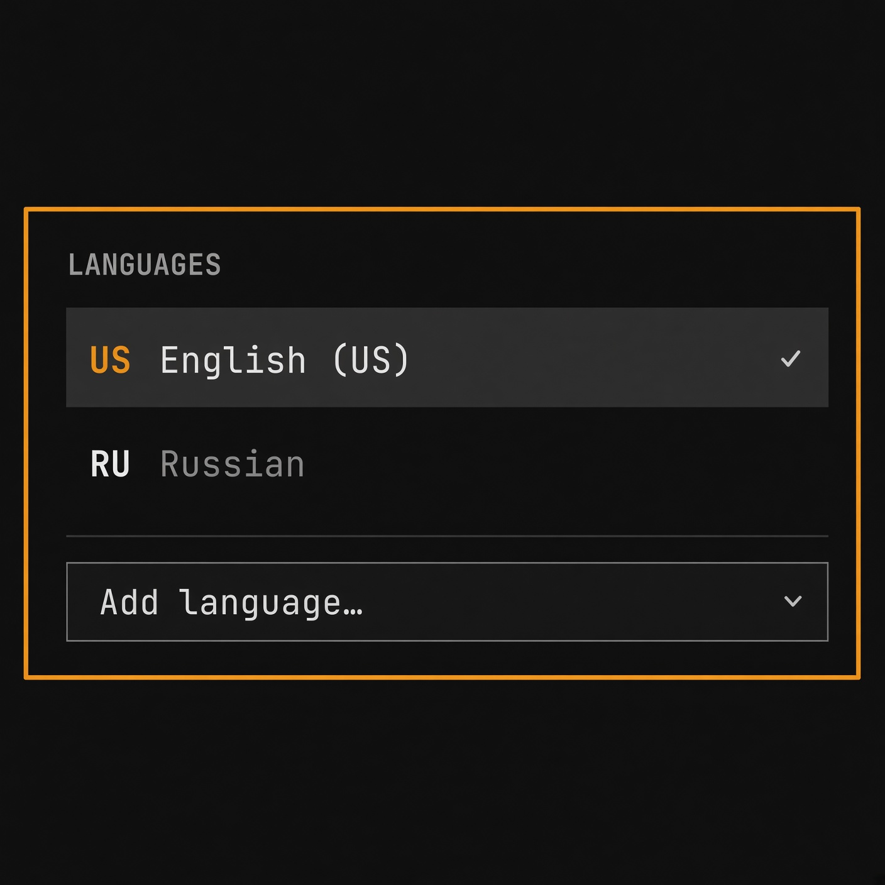

# Omalang — keyboard layouts in the Omarchy bar

Switch, add and remove keyboard layouts from the
[Omarchy](https://github.com/basecamp/omarchy) bar — with a centered
on-screen indicator flashing the new layout after every switch, including
switches made with the Hyprland keybinding (`SUPER+SPACE`).



The bar shows the active layout's abbreviation (`US`, `RU`, …). The panel
lists your layouts with their full names; a search box over the complete
xkb layout catalog adds a new one. The layout list is not the widget's own
state: it lives in the `kb_layout` line of your Hyprland input config, the
same file Omarchy already uses for input overrides — so what the widget
shows is what the compositor actually runs, and changes survive restarts
with or without the widget.

## Requirements

Everything is stock Omarchy — the widget adds no dependencies:

- **Hyprland** — layouts are read from `hyprctl devices`, switched with
  `hyprctl switchxkblayout`, and the switch indicator listens on Hyprland's
  event socket.
- **xkeyboard-config** — the layout catalog behind "Add language…" is
  parsed from the system's xkb rules list
  (`/usr/share/X11/xkb/rules/base.lst`, falling back to `evdev.lst`).

No sudo, no daemons: the config edited is your own file in `~/.config`.

## Install

```bash
omarchy plugin add https://github.com/glafeara/omalang.git
omarchy plugin enable glafeara.languages right
```

`plugin add` is interactive by default; add `--yes` to that command to skip
its prompt. The explicit plugin id and `right` placement make
`plugin enable` non-interactive. The plugin itself is one QML file and one
shell script.

## Using it

**In the bar:** the label is the active layout's abbreviation. Left click
opens and closes the panel, right click cycles to the next layout.

**In the panel:** click a language to switch to it. The active one is
marked with a check. The row under the cursor shows three buttons: arrows
move the language up and down the list, the trash can removes it (the last
remaining language cannot be removed). Order is meaning — the first layout
is the default and `SUPER+SPACE` cycles in list order. "Add language…"
opens a search over every layout *and variant* the system's xkb catalog
knows — English (Dvorak), Russian (Phonetic) and friends are entries of
their own, so the same code can appear twice with different variants.

| Key | Action |
| --- | --- |
| `j` / `k`, arrows | move the cursor |
| `Enter`, `Space` | switch to the selected language |
| `J` / `K` | move the selected language down / up the list |
| `x` | remove the selected language |
| `a`, `/` | open the language search |
| `r` | refresh |
| `Esc` | close |

**The indicator:** after every layout switch — from the panel, the bar's
right click, or the Hyprland keybinding — the new layout's abbreviation
flashes in the middle of the focused monitor: where you are typing, not
where the bar happens to live. It is drawn in the shell's popup card
style and is visual only: its input region is empty, so it never steals a
click or a keystroke from what you are typing. It flashes once per
switch: Hyprland announces a switch once per keyboard and replays it when
a device (re)appears — a connecting bluetooth headset included — and
neither the replays nor the extra per-device announcements flash again.
Virtual keyboards (fcitx5, ydotool) are ignored outright, and on a
multi-monitor setup a single widget instance owns the flash, so two bars
never stack two cards.

**Switching is compositor-wide** (`switchxkblayout all`), the same thing
the stock Omarchy keybinding does, so the widget and the keybinding never
fight over which device's layout counts.

## Settings

| Key | Default | Range |
| --- | --- | --- |
| `osdDurationMs` | `750` | 200–5000, clamped by the widget itself |
| `showOsd` | `true` | `false` disables the centered indicator |

```bash
omarchy bar set glafeara.languages osdDurationMs 1200
omarchy bar set glafeara.languages showOsd false   # no flash on switch
```

## IPC

```bash
omarchy-shell glafeara.languages status          # "ru", "us(dvorak)"
omarchy-shell glafeara.languages list            # index, key, name; * marks active
omarchy-shell glafeara.languages next            # cycle to the next layout
omarchy-shell glafeara.languages set ru          # by code, key or index from list
omarchy-shell glafeara.languages open            # also: close, toggle
```

`status` and `set` speak the same keys, so `set "$(… status)"` round-trips.
A bare code matches the first entry using it; an index from `list` is
always exact.

## What it touches

- **Your Hyprland input config** — the `kb_layout` line and, when variants
  are in play, the `kb_variant` line, edited in place and followed by
  `hyprctl reload` so the change applies immediately. `kb_variant` is
  positional and parallel to `kb_layout`, so the two are always rewritten
  together — removing or reordering a layout never shifts a variant onto a
  neighbour. On Lua-config installs (Hyprland ≥ 0.56 with `hyprland.lua`)
  the file is `~/.config/hypr/input.lua`; older installs keep it in
  `~/.config/hypr/input.conf`. When the file has no live `kb_layout` line —
  stock Omarchy ships it commented out and computes the list in the system
  defaults — the current list is read from the compositor
  (`hyprctl getoption`) and the first change appends a fresh assignment,
  extending the list you actually run rather than replacing it. Nothing
  else in the file is rewritten; inline comments never become part of the
  list; a value the parser does not fully understand refuses every edit
  instead of guessing; and an edit that would leave `kb_layout` empty is
  refused.
- `hyprctl devices` / `hyprctl switchxkblayout` — read the active layout,
  switch it. Read-only apart from the switch itself.
- `/usr/share/X11/xkb/rules/{base,evdev}.lst` — read-only, the layout
  catalog for "Add language…".

Everything runs as your user. No install or uninstall scripts, no
services, no network, no telemetry.

## Tests

`tests/` holds a backend suite that runs against a fake `hyprctl` and
temporary config files — both the `input.conf` and the `input.lua`
dialects, since the sed edits differ — plus static checks pinning the
Panel↔backend contracts (index-based remove/move, ids, settings keys):

```bash
bash tests/run.sh
```

## Uninstall

```bash
omarchy plugin remove glafeara.languages
```

That disables the widget and deletes the plugin directory. Your layout
list stays in your Hyprland input config — it was yours before the widget,
it stays yours after.

## License

MIT — see [LICENSE](LICENSE).
